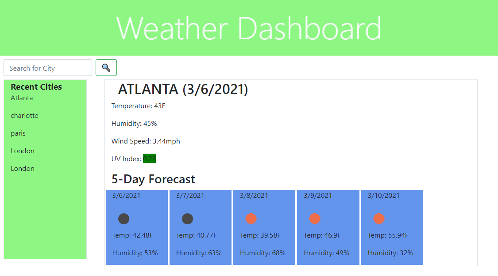

# Weather_Dashboard
This website is a site where users can go for up-to-date weather information on any city of their choosing.  My site shows the current conditions, including the UV Index, letting users know if they need some extra sunscreen and a hat.  Users can also see a 5-day forecast to know how to plan out there week.  

## Motivation
My motivation for this website was to create an easy way for users to see weather conditions for any city across the globe.  Whether you're just leaving your house for work heading or heading on a trip, knowing the weather is vital for your daily activities.  

### Image of my website

 

### Website Address

Visit my [Website](https://joshwalters34.github.io/weather_dashboard/)

### Repository

View my [GitHub_Repository](https://github.com/joshwalters34/weather_dashboard)

### Technologies
HTML5, CSS3, Bootstrap, jquery, Javascript, Moment.js
